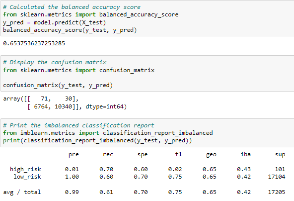
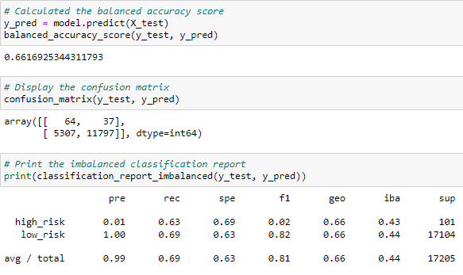
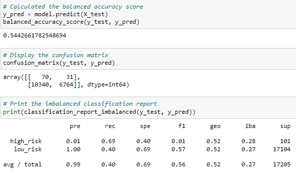
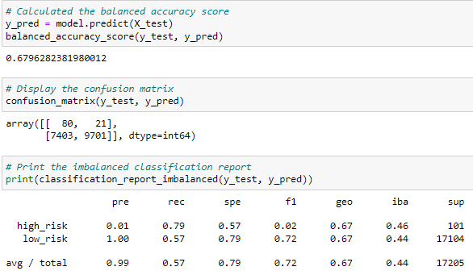
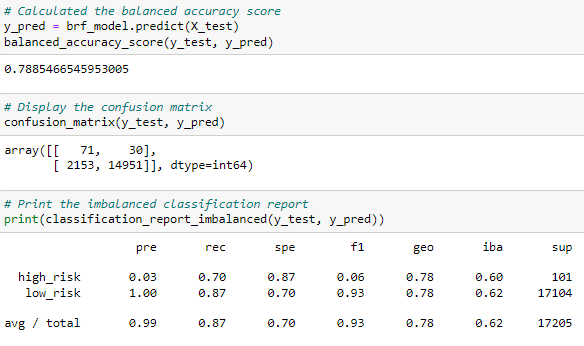
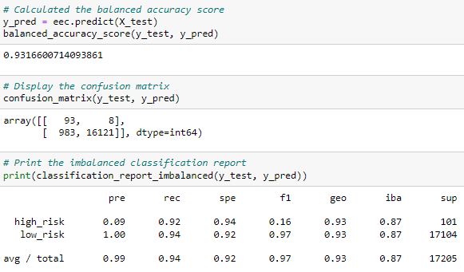

# Credit_Risk_Analysis
Supervised Machine Learning and Credit Risk

## Overview of the analysis

This project is created to analyze credit card risk by employing different techniques to train and evaluate models with unbalanced classes: oversampling with RandomOverSampler and SMOTE algorithms, and undersampling the data using the ClusterCentroids algorithm, then using a combinatorial approach of over- and undersampling using the SMOTEENN algorithm.  And after that compare two new machine learning models that reduce bias, BalancedRandomForestClassifier and EasyEnsembleClassifier, to predict credit risk.

## Results

- **Naive Random Oversampling**  balanced accuracy score and imbalanced classification report:

- **SMOTE Oversampling** balanced accuracy score and imbalanced classification report:

- **Undersampling** balanced accuracy score and imbalanced classification report:

- **Combination (Over and Under) Sampling** balanced accuracy score and imbalanced classification report:

- **Balanced Random Forest Classifier** balanced accuracy score and imbalanced classification report:

- **Easy Ensemble AdaBoost Classifier** balanced accuracy score and imbalanced classification report:

## Summary

- Among sampling models the Combination (Over and Under) Sampling showed better  balanced accuracy score - about 68% (against random oversampling 65%, SMOTE oversampling 66% and undersampling 64.4%).
- However the Easy ensemble classifier model got higher balanced accuracy score (93%) than balanced random forest classifier (79%). Yet both these classification models performed better accuracy score than sampling models.
- F1 score is highest for Easy Ensemble AdaBoost Classifier - 97%
- All the models show much more false-positive over true-positive results which means a lot of customers' credit cards will be blocked for no reason.
- None of the models is suitable for commercial use and further consideration/processing should be done in case the model was partially used in the decision-making process.
